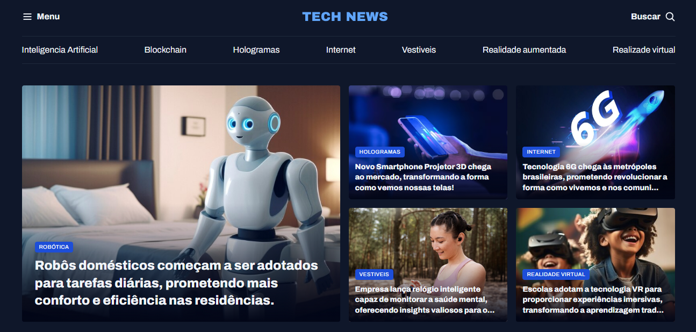

# Portal de notícias

Esse projeto foi desenvolvido após as aulas de CSS Flexbox e CSS Grid com o intuito de praticar os conceitos aprendidos

## Executando

Após clonar o repositório, acesse a pasta do projeto e abra o arquivo `index.html` ou no próprio GitHub clique no link abaixo da seção **About**.
